# DevTree — Architecture Deep Dive

This document explains the design decisions, algorithms, and patterns used throughout the DevTree codebase. It is intended as a learning resource — every section explains not just *what* the code does but *why* it was designed that way, and what you might do differently in production.

---

## Table of Contents

1. [System Overview](#1-system-overview)
2. [Component Hierarchy](#2-component-hierarchy)
3. [Data Model](#3-data-model)
4. [State Management](#4-state-management)
5. [Block Editor](#5-block-editor)
6. [Tree Data Structure](#6-tree-data-structure)
7. [Drag and Drop](#7-drag-and-drop)
8. [Internationalisation (i18n)](#8-internationalisation-i18n)
9. [Theming](#9-theming)
10. [Testing Strategy](#10-testing-strategy)
11. [Deployment (Docker)](#11-deployment-docker)

---

## 1. System Overview

DevTree is a **client-rendered single-page application** built on Next.js. The heavy lifting (block editor, file tree, drag-and-drop) all happens in the browser — the server only handles authentication (NextAuth) and database access (Prisma).

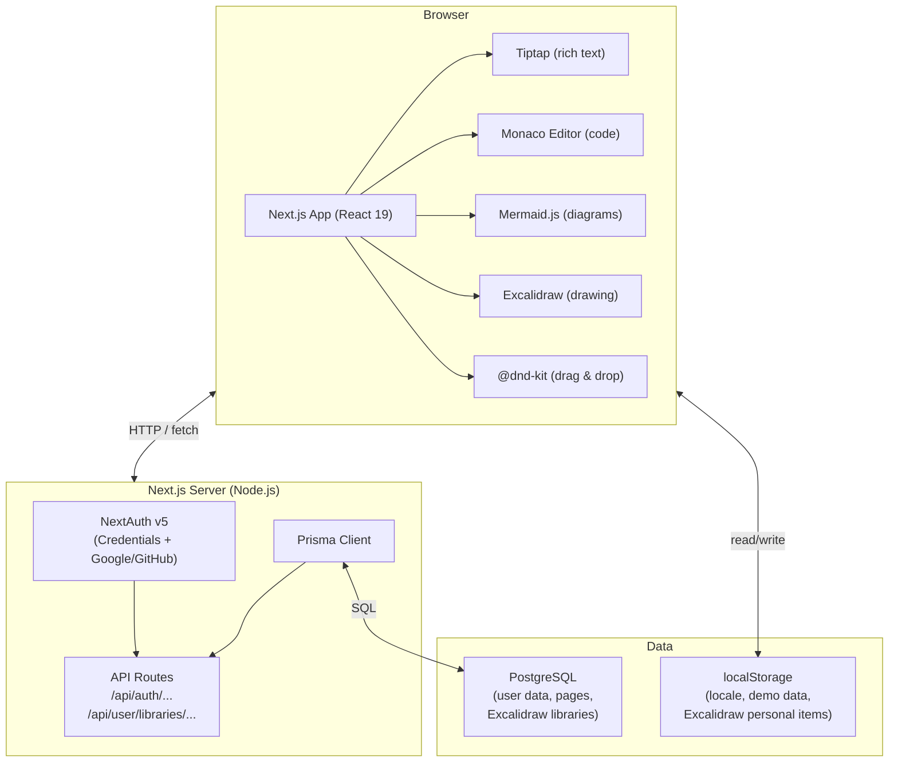
```mermaid
graph TB
    subgraph Browser
        App["Next.js App (React 19)"]
        Tiptap["Tiptap (rich text)"]
        Monaco["Monaco Editor (code)"]
        Mermaid["Mermaid.js (diagrams)"]
        Excalidraw["Excalidraw (drawing)"]
        DndKit["@dnd-kit (drag & drop)"]
        App --> Tiptap
        App --> Monaco
        App --> Mermaid
        App --> Excalidraw
        App --> DndKit
    end

    subgraph Server["Next.js Server (Node.js)"]
        NextAuth["NextAuth v5\n(Credentials + Google/GitHub)"]
        PrismaClient["Prisma Client"]
        API["API Routes\n/api/auth/...\n/api/user/libraries/..."]
        NextAuth --> API
        PrismaClient --> API
    end

    subgraph Data
        PostgreSQL["PostgreSQL\n(user data, pages,\nExcalidraw libraries)"]
        LocalStorage["localStorage\n(locale, demo data,\nExcalidraw personal items)"]
    end

    Browser <-->|"HTTP / fetch"| Server
    PrismaClient <-->|"SQL"| PostgreSQL
    Browser <-->|"read/write"| LocalStorage
```

**Key architecture decision: client-side state**

All page/block state lives in React's `useState` (in `Workspace.tsx`) rather than a database. This means:
- ✅ Zero latency for edits — no server round-trips
- ✅ Works offline
- ❌ Data is lost on page refresh (no persistence in demo mode)
- ❌ No real-time collaboration

*Production improvement:* Add auto-save (debounced API call on every block change) or use a CRDT library like Yjs for real-time collaboration.

---

## 2. Component Hierarchy

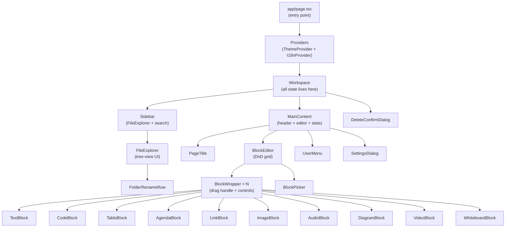
```mermaid
graph TD
    App["app/page.tsx\n(entry point)"]
    App --> Providers["Providers\n(ThemeProvider + I18nProvider)"]
    Providers --> Workspace

    Workspace["Workspace\n(all state lives here)"]
    Workspace --> Sidebar["Sidebar\n(FileExplorer + search)"]
    Workspace --> MainContent["MainContent\n(header + editor + stats)"]
    Workspace --> DeleteConfirmDialog

    Sidebar --> FileExplorer["FileExplorer\n(tree-view UI)"]
    FileExplorer --> FolderRenameRow

    MainContent --> PageTitle
    MainContent --> BlockEditor["BlockEditor\n(DnD grid)"]
    MainContent --> UserMenu
    MainContent --> SettingsDialog

    BlockEditor --> BlockWrapper["BlockWrapper × N\n(drag handle + controls)"]
    BlockEditor --> BlockPicker

    BlockWrapper --> TextBlock
    BlockWrapper --> CodeBlock
    BlockWrapper --> TableBlock
    BlockWrapper --> AgendaBlock
    BlockWrapper --> LinkBlock
    BlockWrapper --> ImageBlock
    BlockWrapper --> AudioBlock
    BlockWrapper --> DiagramBlock
    BlockWrapper --> VideoBlock
    BlockWrapper --> WhiteboardBlock
```

**Why is all state in `Workspace`?**

This is the "lifting state up" pattern. The sidebar needs to know which page is active (to highlight it in the tree). `MainContent` needs the active page's blocks. Rather than duplicating state or using global state, both components receive what they need as props from their common ancestor (`Workspace`).

*Alternative:* A global state manager (Zustand, Redux) would make sense once the component tree gets deeper than 3-4 levels or when sibling components at the same level need to share state without a common parent.

---

## 3. Data Model

### Page and Block

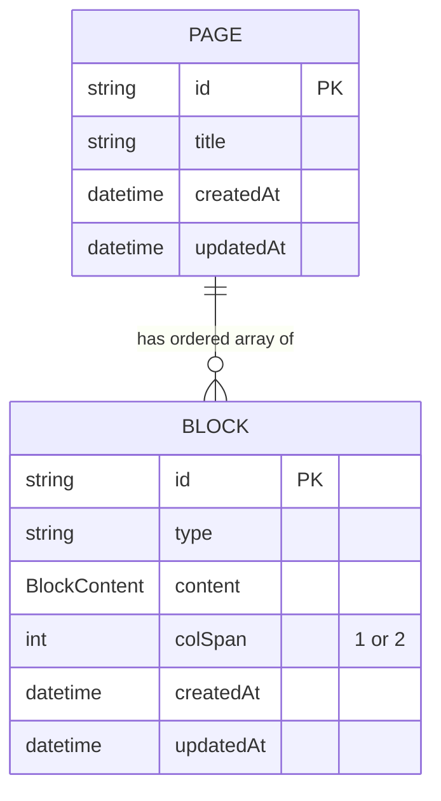
```mermaid
erDiagram
    PAGE {
        string id PK
        string title
        datetime createdAt
        datetime updatedAt
    }
    BLOCK {
        string id PK
        string type
        BlockContent content
        int colSpan "1 or 2"
        datetime createdAt
        datetime updatedAt
    }
    PAGE ||--o{ BLOCK : "has ordered array of"
```

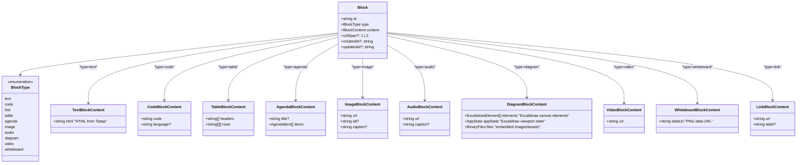
```mermaid
classDiagram
    class Block {
        +string id
        +BlockType type
        +BlockContent content
        +colSpan?: 1 | 2
        +createdAt?: string
        +updatedAt?: string
    }

    class BlockType {
        <<enumeration>>
        text
        code
        link
        table
        agenda
        image
        audio
        diagram
        video
        whiteboard
    }

    class TextBlockContent {
        +string html "HTML from Tiptap"
    }
    class CodeBlockContent {
        +string code
        +string language?
    }
    class TableBlockContent {
        +string[] headers
        +string[][] rows
    }
    class AgendaBlockContent {
        +string title?
        +AgendaItem[] items
    }
    class ImageBlockContent {
        +string url
        +string alt?
        +string caption?
    }
    class AudioBlockContent {
        +string url
        +string caption?
    }
    class DiagramBlockContent {
        +ExcalidrawElement[] elements "Excalidraw canvas elements"
        +AppState appState "Excalidraw viewport state"
        +BinaryFiles files "embedded images/assets"
    }
    class VideoBlockContent {
        +string url
    }
    class WhiteboardBlockContent {
        +string dataUrl "PNG data URL"
    }
    class LinkBlockContent {
        +string url
        +string label?
    }

    Block --> BlockType
    Block --> TextBlockContent : "type=text"
    Block --> CodeBlockContent : "type=code"
    Block --> TableBlockContent : "type=table"
    Block --> AgendaBlockContent : "type=agenda"
    Block --> ImageBlockContent : "type=image"
    Block --> AudioBlockContent : "type=audio"
    Block --> DiagramBlockContent : "type=diagram"
    Block --> VideoBlockContent : "type=video"
    Block --> WhiteboardBlockContent : "type=whiteboard"
    Block --> LinkBlockContent : "type=link"
```

The `createdAt` and `updatedAt` fields are ISO datetime strings forwarded from the Prisma model via `apiBlockToBlock()` / `apiPageToPage()`. They are optional in the frontend type so that optimistically-created blocks (before the server response arrives) are still valid. The page-level timestamps are displayed below the tag bar as relative text ("3 days ago") with a full date tooltip on hover. Block-level timestamps appear as a hover-only micro-line below the block's tag row.

**Why a discriminated union for `BlockContent`?**

Each block type has a completely different shape. A discriminated union (`type TextBlockContent = string | CodeBlockContent | ...`) allows TypeScript to narrow the type based on runtime checks:

```typescript
if (type === 'code' && isCodeBlockContent(content, type)) {
  // TypeScript knows content is CodeBlockContent here
  return <CodeBlock content={content} onChange={onChange} />;
}
```

Without this, every component would need `as` casts, losing type safety.

### Excalidraw Library Model

URL-sourced Excalidraw libraries are stored in the database with deduplication at the `sourceUrl` level. Multiple users can reference the same library entry.

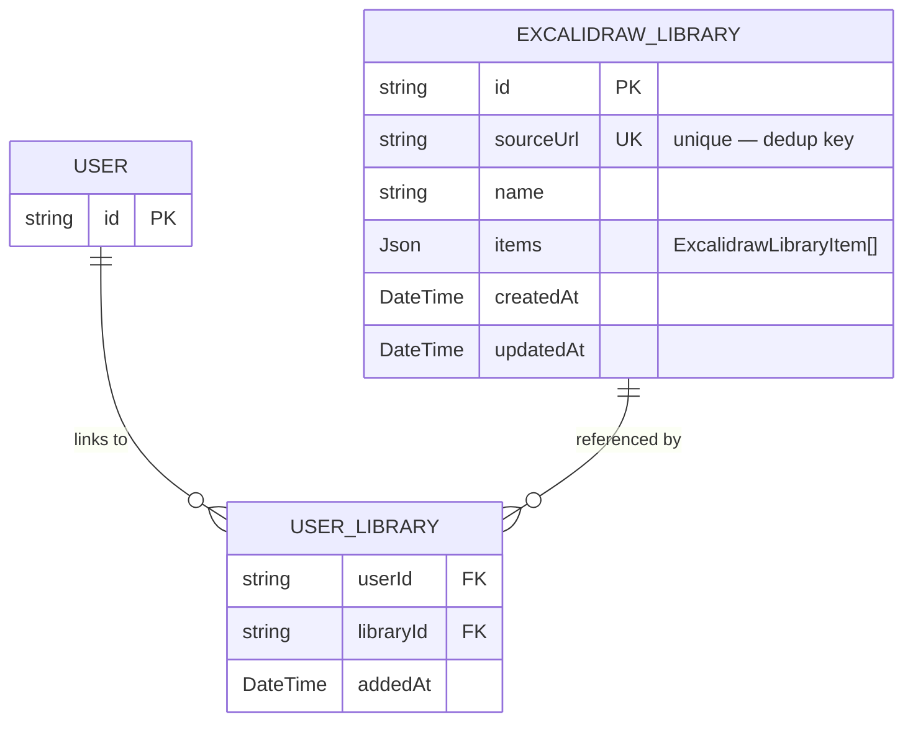
```mermaid
erDiagram
    USER {
        string id PK
    }
    EXCALIDRAW_LIBRARY {
        string id PK
        string sourceUrl UK "unique — dedup key"
        string name
        Json items "ExcalidrawLibraryItem[]"
        DateTime createdAt
        DateTime updatedAt
    }
    USER_LIBRARY {
        string userId FK
        string libraryId FK
        DateTime addedAt
    }

    USER ||--o{ USER_LIBRARY : "links to"
    EXCALIDRAW_LIBRARY ||--o{ USER_LIBRARY : "referenced by"
```

**Design decisions:**

| Decision | Rationale |
|----------|-----------|
| `sourceUrl @unique` | Two users importing the same URL share one DB row — content isn't duplicated |
| `UserLibrary` join table | Tracks per-user access; `onDelete: Cascade` on both FKs keeps DB clean when a user or library is deleted |
| `items Json` | Excalidraw `ExcalidrawLibraryItem[]` shape changes across versions; `Json` avoids schema migrations for format changes |
| Personal items not persisted | Items created directly in Excalidraw (no `sourceUrl`) live in `localStorage` only — they have no canonical URL to deduplicate on |

**Library persistence layers** (lowest → highest priority merge order):

1. **Excalidraw's own `excalidraw-library` localStorage key** — all personal library items are persisted automatically by Excalidraw itself. We intentionally do NOT maintain a parallel custom key; doing so creates two copies with identical IDs that Excalidraw merges into one list, causing React duplicate-key warnings.
2. **Backend (`GET /api/user/libraries`)** — URL-sourced libraries the user has imported across any device, loaded on mount when authenticated and merged via `updateLibrary({ merge: true })`.  Excalidraw deduplicates by item ID so repeat loads are safe.
3. **Hash import (`#addLibrary=URL&token=`)** — on-demand import via `libraries.excalidraw.com` redirect; merged into the live canvas and saved to the backend.

### Tree Model

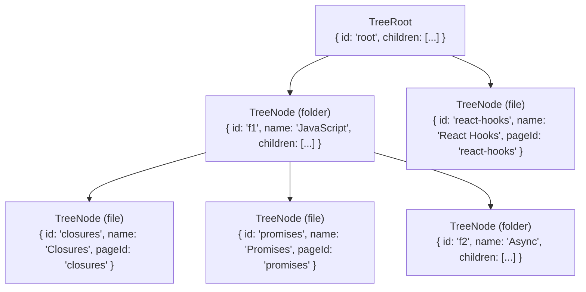
```mermaid
graph TD
    Root["TreeRoot\n{ id: 'root', children: [...] }"]
    Root --> F1["TreeNode (folder)\n{ id: 'f1', name: 'JavaScript', children: [...] }"]
    Root --> P1["TreeNode (file)\n{ id: 'react-hooks', name: 'React Hooks', pageId: 'react-hooks' }"]
    F1 --> P2["TreeNode (file)\n{ id: 'closures', name: 'Closures', pageId: 'closures' }"]
    F1 --> P3["TreeNode (file)\n{ id: 'promises', name: 'Promises', pageId: 'promises' }"]
    F1 --> F2["TreeNode (folder)\n{ id: 'f2', name: 'Async', children: [...] }"]
```

**Two separate data structures — why?**

| Structure | Stores | Used for |
|-----------|--------|----------|
| `TreeRoot` | Hierarchy + pageId references | Sidebar navigation |
| `Page[]` | Titles + block content | Editor |

The tree stores *where* pages live (folder hierarchy). The pages array stores *what* pages contain (blocks). This separation mirrors a real file system: the directory listing stores paths, not file contents.

---

## 4. State Management

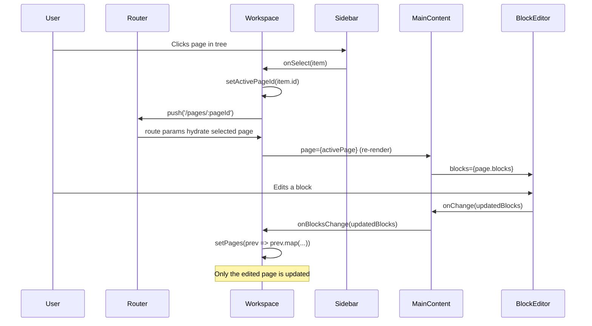
```mermaid
sequenceDiagram
    participant User
    participant Router
    participant Workspace
    participant Sidebar
    participant MainContent
    participant BlockEditor

    User->>Sidebar: Clicks page in tree
    Sidebar->>Workspace: onSelect(item)
    Workspace->>Workspace: setActivePageId(item.id)
    Workspace->>Router: push('/pages/:pageId')
    Router->>Workspace: route params hydrate selected page
    Workspace->>MainContent: page={activePage} (re-render)
    MainContent->>BlockEditor: blocks={page.blocks}

    User->>BlockEditor: Edits a block
    BlockEditor->>MainContent: onChange(updatedBlocks)
    MainContent->>Workspace: onBlocksChange(updatedBlocks)
    Workspace->>Workspace: setPages(prev => prev.map(...))
    Note over Workspace: Only the edited page is updated
```

Route selection is URL-driven: `activePageId` syncs with `/pages/[pageId]`. Opening a deep link expands the selected page's folder ancestry in the tree and highlights the corresponding row. Invalid page ids keep the workspace in empty-state mode.

**Immutability pattern**

Every state update creates a new array/object instead of mutating in place:

```typescript
// ✅ Correct — creates a new page array
setPages(prev => prev.map(p =>
  p.id === activePageId ? { ...p, blocks } : p
));

// ❌ Wrong — mutates React state directly
pages.find(p => p.id === activePageId).blocks = blocks; // never do this
```

Why? React detects changes by comparing references (`Object.is`). If you mutate an object, the reference stays the same, React sees "no change", and the component doesn't re-render.

**`useCallback` and `useMemo` usage**

- `useCallback` wraps event handlers that are passed to child components. Without it, a new function reference is created on every parent render, causing children to re-render even when nothing changed.
- `useMemo` wraps derived values (like `treeData`, `activePage`, `searchResults`) that are expensive to recompute.

### Save-on-Demand Strategy

DevTree uses **explicit save** rather than auto-save. The user must click the Save button (or press `Cmd/Ctrl+S`) to persist changes to the server. Until then, all edits exist only in React state (in `Workspace`).

#### Why explicit save?

| Auto-save | Explicit save |
|-----------|---------------|
| Every keystroke → API call | Single API call per save |
| Hard to batch/reorder blocks | Full diff-sync on save |
| Hard to detect "no changes" | `isDirty` flag prevents redundant calls |
| Good for collaborative editors | Good for single-user note editors |

DevTree is a single-user note-taking tool, so explicit save is the simpler, lower-latency choice.

#### The `isDirty` flag

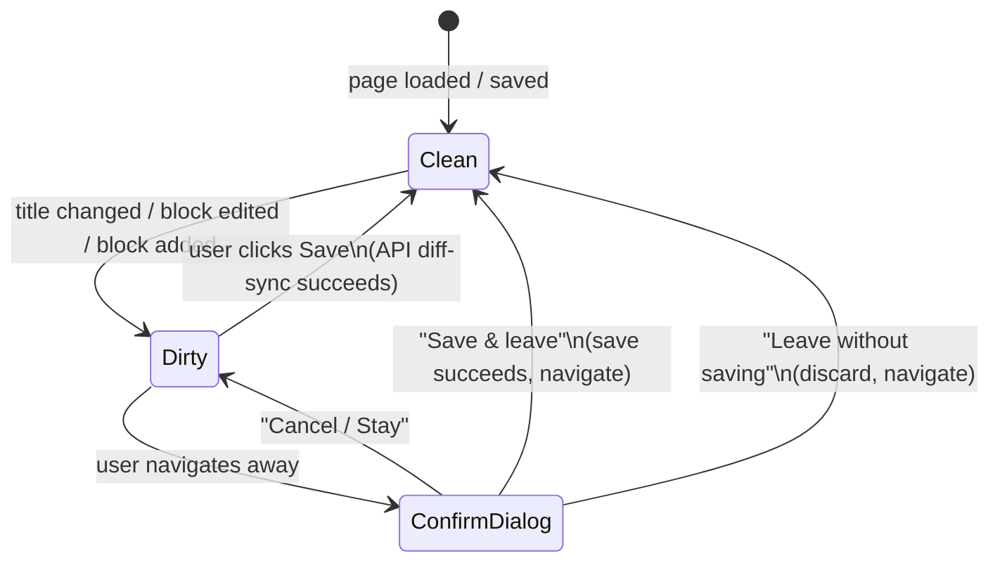
```mermaid
stateDiagram-v2
    [*] --> Clean : page loaded / saved
    Clean --> Dirty : title changed / block edited / block added
    Dirty --> Clean : user clicks Save\n(API diff-sync succeeds)
    Dirty --> ConfirmDialog : user navigates away
    ConfirmDialog --> Clean : "Save & leave"\n(save succeeds, navigate)
    ConfirmDialog --> Clean : "Leave without saving"\n(discard, navigate)
    ConfirmDialog --> Dirty : "Cancel / Stay"
```

The `isDirty: boolean` state in `Workspace` tracks whether the currently displayed page has local changes not yet persisted to the server. The Save button in `MainContent` is:
- **Disabled** when `isDirty === false` — no redundant API calls.
- **Enabled** when `isDirty === true` — indicates there is something to save.

#### The diff-sync algorithm (`handleSave`)

When the user saves, `handleSave` compares the current local block list against `serverBlocksRef` (a `Map<pageId, Block[]>` that holds the last-persisted server state):

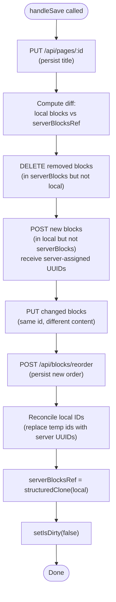
```mermaid
flowchart TD
    A([handleSave called]) --> B["PUT /api/pages/:id\n(persist title)"]
    B --> C["Compute diff:\nlocal blocks vs serverBlocksRef"]
    C --> D["DELETE removed blocks\n(in serverBlocks but not local)"]
    D --> E["POST new blocks\n(in local but not serverBlocks)\nreceive server-assigned UUIDs"]
    E --> F["PUT changed blocks\n(same id, different content)"]
    F --> G["POST /api/blocks/reorder\n(persist new order)"]
    G --> H["Reconcile local IDs\n(replace temp ids with server UUIDs)"]
    H --> I["serverBlocksRef = structuredClone(local)"]
    I --> J["setIsDirty(false)"]
    J --> K([Done])
```

**Why `serverBlocksRef` instead of state?**

`serverBlocksRef` is a `useRef` (not `useState`) because:
1. It should **not** trigger a re-render when updated — it's only read during `handleSave`.
2. It persists across renders without being a dependency of `useMemo`/`useCallback`.
3. Think of it as a "snapshot" of what the server knows — only updated when a save succeeds.

#### Block ID lifecycle

Every block created locally gets a temporary ID `block-${uuid}`. When `handleSave` POSTs new blocks to the server, the server assigns its own UUIDs. The client then swaps the temporary IDs for the real server IDs throughout `pages` state and `serverBlocksRef`:

```
Local block:  { id: "block-abc123", type: "text", ... }
After save:   { id: "b3f9e712-...", type: "text", ... }  ← server UUID
```

This reconciliation step is essential: without it, subsequent PUT/DELETE calls would 404 because they'd send the local temporary ID, which the server doesn't recognise.

#### Unsaved-changes navigation guard

`handleSelect` in `Workspace` checks `isDirty` before navigating:

```typescript
if (isDirty) {
  setPendingNavId(item.id);  // remember where the user wanted to go
  return;                    // show UnsavedChangesDialog instead of navigating
}
setActivePageId(item.id);   // normal navigation
```

The `<UnsavedChangesDialog>` presents three choices:
1. **Save and leave** — runs `handleSave()`, then navigates to `pendingNavId`.
2. **Leave without saving** — discards local changes (restores from `serverBlocksRef`), navigates.
3. **Cancel / Stay** — closes the dialog, user stays on the current dirty page.

---

## 5. Block Editor

### Column Layout Algorithm

The block grid uses CSS `grid-cols-2`. Each block can be `colSpan: 1` (half-width) or `colSpan: 2` (full-width). The `computeColumnMap` function determines which visual column (left=0, right=1) each half-width block occupies — this is needed so editing controls appear on the *outer* edge of the block, not between adjacent blocks.

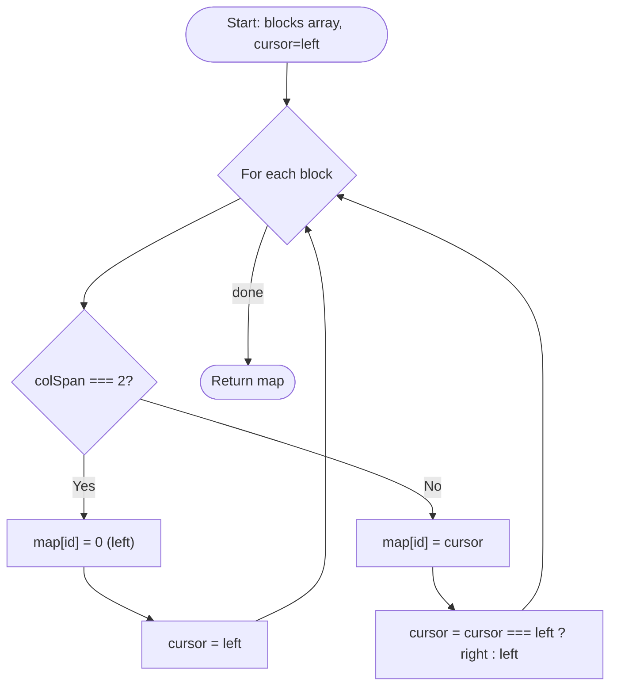
```mermaid
flowchart TD
    Start([Start: blocks array, cursor=left])
    Loop{For each block}
    FullWidth{colSpan === 2?}
    MapLeft["map[id] = 0 (left)"]
    ResetCursor["cursor = left"]
    MapCurrent["map[id] = cursor"]
    FlipCursor["cursor = cursor === left ? right : left"]
    End([Return map])

    Start --> Loop
    Loop --> FullWidth
    FullWidth -- Yes --> MapLeft --> ResetCursor --> Loop
    FullWidth -- No --> MapCurrent --> FlipCursor --> Loop
    Loop -- done --> End
```

Example for `[half, half, full, half, half]`:
```
Block 0 (half): column 0 (left),  cursor → right
Block 1 (half): column 1 (right), cursor → left
Block 2 (full): column 0 (left),  cursor reset → left
Block 3 (half): column 0 (left),  cursor → right
Block 4 (half): column 1 (right), cursor → left
```

Visual result:
```
┌─────────────┬─────────────┐
│  Block 0    │  Block 1    │
├─────────────┴─────────────┤
│         Block 2           │
├─────────────┬─────────────┤
│  Block 3    │  Block 4    │
└─────────────┴─────────────┘
```

### Block Type Guard Pattern

```typescript
// In BlockEditor's BlockContent render function:
if (type === 'code' && isCodeBlockContent(content, type)) {
  return <CodeBlock content={content} onChange={onChange} />;
}
```

The double check (`type === 'code'` AND `isCodeBlockContent`) is intentional:
1. `type` is the canonical discriminant — authoritative, fast.
2. `isCodeBlockContent` checks the runtime shape — catches corrupted data.
3. TypeScript uses both to narrow `content` to `CodeBlockContent`.

### DiagramBlock (Excalidraw)

The `diagram` block type embeds [Excalidraw](https://github.com/excalidraw/excalidraw) — an infinite-canvas drawing tool. Three non-obvious issues required specific solutions.

#### 1. Drawing offset in scrollable view

**Problem**: `MainContent` uses an `overflow-y-auto` scroll container. Excalidraw caches `offsetTop`/`offsetLeft` in its AppState to convert pointer events to canvas coordinates. A `ResizeObserver` updates these on size changes but **not on scroll** — the canvas moves within the viewport without resizing.

**Solution** (two-part, no DOM-walking):
1. Call `excalidrawAPI.refresh()` via `requestAnimationFrame` once on mount so the initial offset is measured **after the browser paints** (avoids the case where Excalidraw measured its position while the block was off-screen during SSR/hydration).
2. Listen to `scroll` on `window` with `{ capture: true, passive: true }`. Scroll events don't bubble, but they **do** traverse the capture phase — a window capture listener fires for scroll on **any element in the document** without needing to walk the DOM.

```tsx
useEffect(() => {
  if (!excalidrawAPI || fullscreen) return;
  const rafId = requestAnimationFrame(() => excalidrawAPI.refresh());
  const handleScroll = () => excalidrawAPI.refresh();
  window.addEventListener('scroll', handleScroll, { capture: true, passive: true });
  return () => {
    cancelAnimationFrame(rafId);
    window.removeEventListener('scroll', handleScroll, { capture: true });
  };
}, [excalidrawAPI, fullscreen]);
```

Skipped in fullscreen mode (the overlay covers the entire viewport — no outer scroll container).

#### 2. Library import from `libraries.excalidraw.com`

**Problem**: When a user clicks "Add to Excalidraw" on the public library site, the browser redirects back to the app with a `#addLibrary=URL&token=TOKEN` hash. Excalidraw only processes this hash at its own initial mount — it ignores hash changes after the fact, and if the user isn't on a page that has a Diagram block open, the hash is dropped entirely.

**Solution**: A `useEffect` that runs whenever `excalidrawAPI` becomes available:
1. Dynamically imports `parseLibraryTokensFromUrl` from `@excalidraw/excalidraw`
2. Calls it — returns `{ libraryUrl }` if the current URL contains `#addLibrary=…`
3. Fetches the `.excalidrawlib` JSON file from `libraryUrl`
4. Parses the v1 (`library[]`) or v2 (`libraryItems[]`) format
5. Calls `excalidrawAPI.updateLibrary({ libraryItems, merge: true, openLibraryMenu: true })`
6. If authenticated, `POST /api/user/libraries` to persist it on the backend
7. Strips the hash via `history.replaceState` to prevent double-import on re-render

A `hashchange` listener is also registered so that subsequent imports in the same browser session are handled without a full page reload.

#### 3. Backend library persistence

See [Excalidraw Library Model](#excalidraw-library-model) in the Data Model section and the API endpoints below.

**API surface:**

| Method | Path | Purpose |
|--------|------|---------|
| `GET` | `/api/user/libraries` | Returns all library entries for the current user (merged `items` array) |
| `POST` | `/api/user/libraries` | Upsert a library by `sourceUrl`; links it to the current user |
| `DELETE` | `/api/user/libraries/:id` | Unlinks a library from the current user (idempotent) |

**Sequence — loading libraries on mount:**

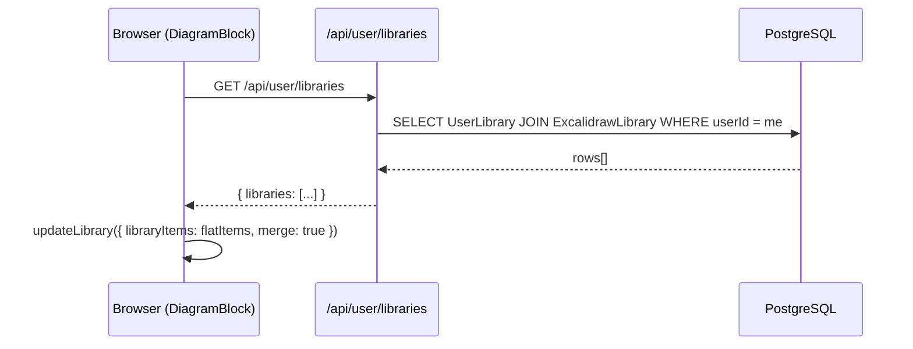
```mermaid
sequenceDiagram
    participant B as Browser (DiagramBlock)
    participant A as /api/user/libraries
    participant DB as PostgreSQL

    B->>A: GET /api/user/libraries
    A->>DB: SELECT UserLibrary JOIN ExcalidrawLibrary WHERE userId = me
    DB-->>A: rows[]
    A-->>B: { libraries: [...] }
    B->>B: updateLibrary({ libraryItems: flatItems, merge: true })
```

**Sequence — importing from library site:**

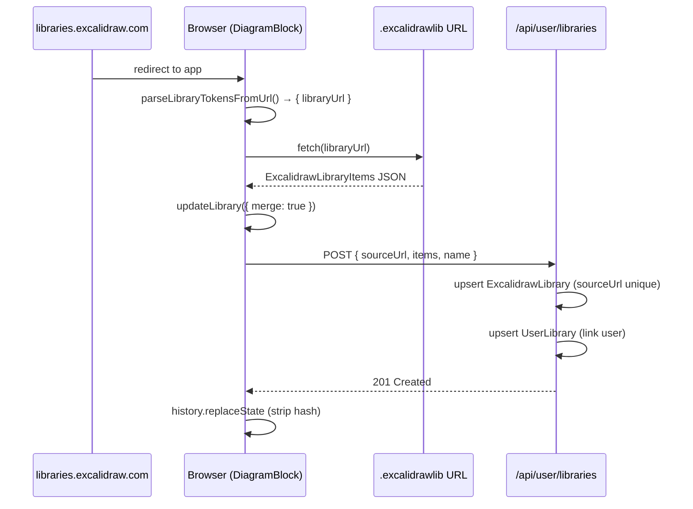
```mermaid
sequenceDiagram
    participant Site as libraries.excalidraw.com
    participant B as Browser (DiagramBlock)
    participant Lib as .excalidrawlib URL
    participant A as /api/user/libraries

    Site->>B: redirect to app#addLibrary=URL&token=T
    B->>B: parseLibraryTokensFromUrl() → { libraryUrl }
    B->>Lib: fetch(libraryUrl)
    Lib-->>B: ExcalidrawLibraryItems JSON
    B->>B: updateLibrary({ merge: true })
    B->>A: POST { sourceUrl, items, name }
    A->>A: upsert ExcalidrawLibrary (sourceUrl unique)
    A->>A: upsert UserLibrary (link user)
    A-->>B: 201 Created
    B->>B: history.replaceState (strip hash)
```

---

## 6. Tree Data Structure

### Immutable Updates (Path Copying)

When a node deep in the tree is modified, we create new objects only along the *path* from the root to that node. Other branches keep their original references (structural sharing).

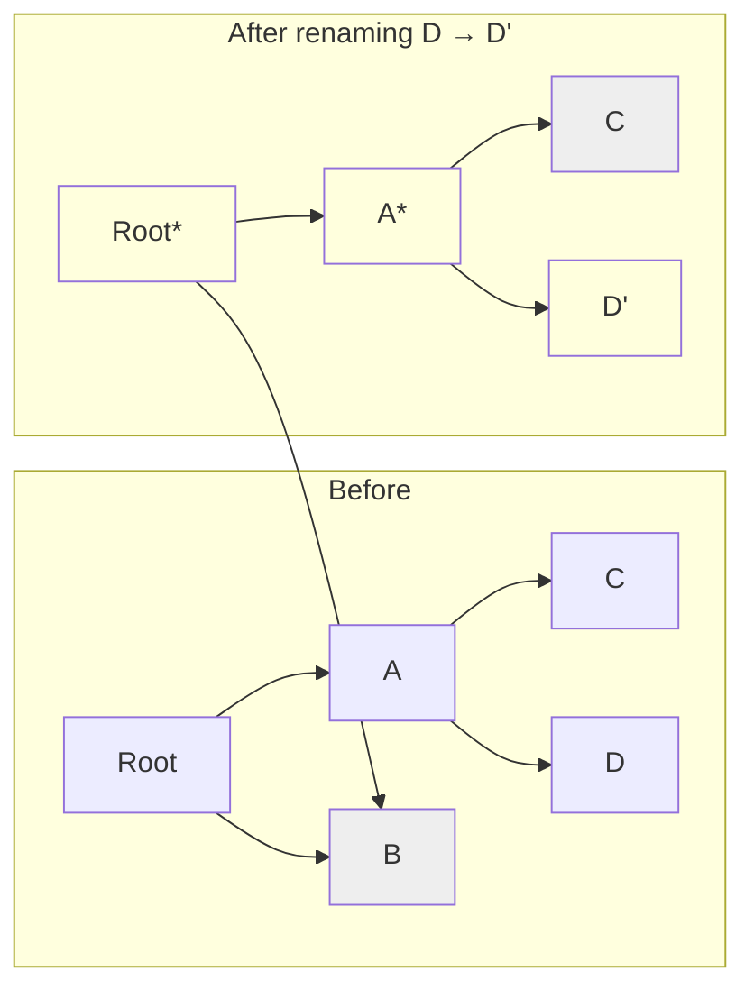
```mermaid
graph LR
    subgraph Before
        R1[Root] --> A1[A] --> C1[C]
        R1 --> B1[B]
        A1 --> D1[D]
    end

    subgraph After["After renaming D → D'"]
        R2[Root*] --> A2[A*] --> C2[C]
        R2 --> B1
        A2 --> D2[D']
        style R2 fill:#ffd
        style A2 fill:#ffd
        style D2 fill:#ffd
        style C2 fill:#eee
        style B1 fill:#eee
    end
```

`*` = new object. `C` and `B` are **shared** — no copies made.

### Cycle Detection in `moveNode`

When a user drags a folder into one of its own descendants, `moveNode` must detect and reject the operation to prevent a circular tree.

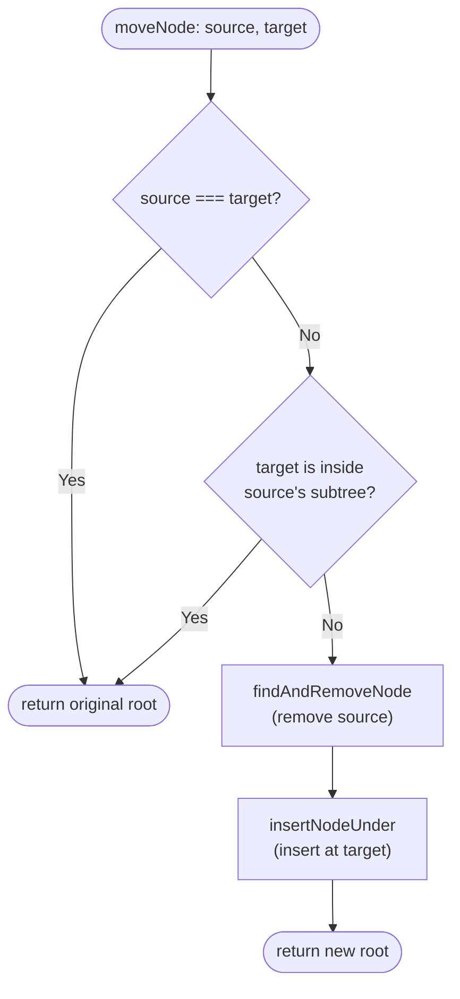
```mermaid
flowchart TD
    Start([moveNode: source, target])
    SameCheck{source === target?}
    CycleCheck{target is inside\nsource's subtree?}
    Remove["findAndRemoveNode\n(remove source)"]
    Insert["insertNodeUnder\n(insert at target)"]
    ReturnSame([return original root])
    ReturnNew([return new root])

    Start --> SameCheck
    SameCheck -- Yes --> ReturnSame
    SameCheck -- No --> CycleCheck
    CycleCheck -- Yes --> ReturnSame
    CycleCheck -- No --> Remove --> Insert --> ReturnNew
```

`wouldCreateCycle` collects all ids in the source's subtree and checks if `targetId` is among them — O(n) where n = subtree size.

---

## 7. Drag and Drop

DevTree uses [@dnd-kit](https://dndkit.com) for two separate drag-and-drop systems:

### Block reordering (BlockEditor)

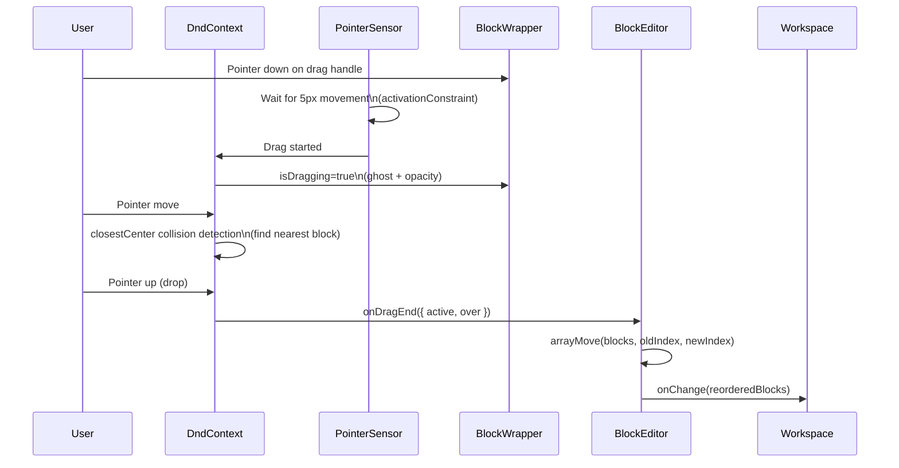
```mermaid
sequenceDiagram
    participant User
    participant DndContext
    participant PointerSensor
    participant BlockWrapper
    participant BlockEditor

    User->>BlockWrapper: Pointer down on drag handle
    PointerSensor->>PointerSensor: Wait for 5px movement\n(activationConstraint)
    PointerSensor->>DndContext: Drag started
    DndContext->>BlockWrapper: isDragging=true\n(ghost + opacity)

    User->>DndContext: Pointer move
    DndContext->>DndContext: closestCenter collision detection\n(find nearest block)

    User->>DndContext: Pointer up (drop)
    DndContext->>BlockEditor: onDragEnd({ active, over })
    BlockEditor->>BlockEditor: arrayMove(blocks, oldIndex, newIndex)
    BlockEditor->>Workspace: onChange(reorderedBlocks)
```

**Why `activationConstraint: { distance: 5 }`?**

Without it, any mousedown on a draggable starts a drag. This makes clicking buttons *inside* blocks impossible (they'd start a drag instead). The 5px threshold means the user must intentionally move the pointer before the drag begins.

**Why `restrictToVerticalAxis` modifier?**

Blocks should only reorder vertically (up/down). Without this modifier, dragging creates horizontal ghost movement which looks wrong in a vertically-scrolling list.

### File tree reordering (FileExplorer)

The tree drag-and-drop is handled separately in the `tree-view` UI component. When a tree item is dropped, `handleDocumentDrag` in `Workspace` calls `moveNode` from `treeUtils.ts`.

Special case: dropping onto a *file* node redirects the drop to the file's *parent* folder (so you can't nest folders inside pages).

---

## 8. Internationalisation (i18n)

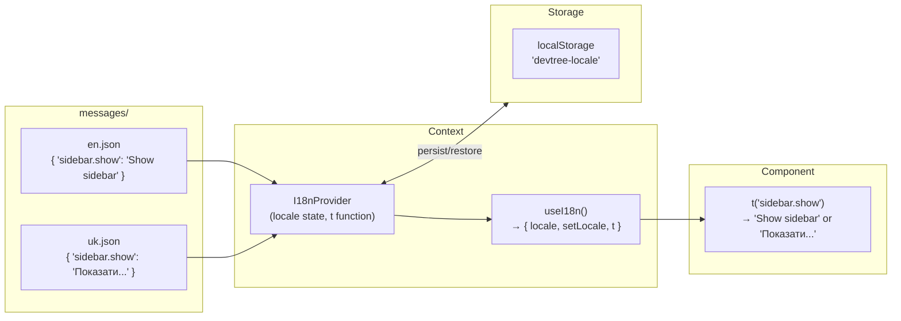
```mermaid
flowchart LR
    subgraph Files["messages/"]
        EN["en.json\n{ 'sidebar.show': 'Show sidebar' }"]
        UK["uk.json\n{ 'sidebar.show': 'Показати...' }"]
    end

    subgraph Context
        Provider["I18nProvider\n(locale state, t function)"]
        Hook["useI18n()\n→ { locale, setLocale, t }"]
    end

    subgraph Component
        Call["t('sidebar.show')\n→ 'Show sidebar' or 'Показати...'"]
    end

    EN & UK --> Provider
    Provider --> Hook
    Hook --> Call

    subgraph Storage
        LS["localStorage\n'devtree-locale'"]
    end

    Provider <-->|persist/restore| Storage
```

**Template substitution:**

```
"delete.folderDescription": "\"{{name}}\" contains {{count}} item(s)."

t('delete.folderDescription', { name: 'Notes', count: 5 })
→ '"Notes" contains 5 item(s).'
```

The regex `\\{\\{${k}\\}\\}` with flag `g` replaces all occurrences of `{{key}}` in the template string. The double-brace syntax is borrowed from Handlebars/Mustache, which users are likely familiar with.

**Hydration safety:**

The server always renders in English (`useState('en')`). After hydration, a `useEffect` reads localStorage and updates the locale. This prevents a React hydration mismatch (server HTML ≠ client HTML).

---

## 9. Theming

DevTree uses [`next-themes`](https://github.com/pacocoursey/next-themes) with the CSS class strategy:

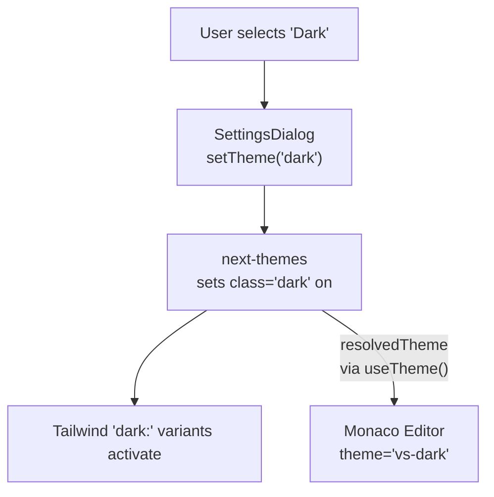
```mermaid
flowchart TD
    User["User selects 'Dark'"]
    Settings["SettingsDialog\nsetTheme('dark')"]
    NextThemes["next-themes\nsets class='dark' on <html>"]
    Tailwind["Tailwind 'dark:' variants activate"]
    Monaco["Monaco Editor\ntheme='vs-dark'"]

    User --> Settings --> NextThemes --> Tailwind
    NextThemes -->|"resolvedTheme\n via useTheme()"| Monaco
```

Tailwind's `dark:` utility classes (e.g. `dark:bg-zinc-900`) are compiled to:

```css
.dark .bg-zinc-900 { /* applied */ }
```

When `next-themes` adds `class="dark"` to `<html>`, all `dark:` classes activate instantly — no JavaScript needed at runtime.

**Monaco theme sync:**

Monaco has its own internal theme (`vs` / `vs-dark`). We use `useTheme().resolvedTheme` to read the actual current theme (resolving 'system' to the OS preference) and pass it to `<MonacoEditor theme={editorTheme}>`.

---

## 10. Testing Strategy

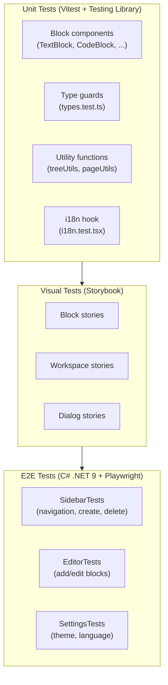
```mermaid
graph TD
    subgraph Unit["Unit Tests (Vitest + Testing Library)"]
        UBlock["Block components\n(TextBlock, CodeBlock, ...)"]
        UTypes["Type guards\n(types.test.ts)"]
        UUtils["Utility functions\n(treeUtils, pageUtils)"]
        UI18n["i18n hook\n(i18n.test.tsx)"]
    end

    subgraph Visual["Visual Tests (Storybook)"]
        SBlock["Block stories"]
        SWorkspace["Workspace stories"]
        SDialogs["Dialog stories"]
    end

    subgraph E2E["E2E Tests (C# .NET 9 + Playwright)"]
        ESidebar["SidebarTests\n(navigation, create, delete)"]
        EEditor["EditorTests\n(add/edit blocks)"]
        ESettings["SettingsTests\n(theme, language)"]
    end

    Unit --> Visual --> E2E
```

### Testing pyramid rationale

| Layer | Count | Speed | Confidence | Cost |
|-------|-------|-------|-----------|------|
| Unit tests | ~229 | ~3s | Component logic | Low |
| Storybook stories | ~20 | Manual | Visual appearance | Low |
| E2E tests | ~32 | ~60s | Full user journeys | High |

**Unit test philosophy:**

- Test behaviour, not implementation. `screen.getByRole('button', { name: /save/i })` is more resilient than `container.querySelector('.save-btn')`.
- Use `fireEvent.change` for controlled inputs (vs `userEvent.type`) — controlled React inputs don't re-render with `userEvent.type` in isolation.
- Wrap components using `useI18n` in `<I18nProvider>`.
- Mock external dependencies (Monaco Editor, Mermaid, next-themes) via `vi.mock()`.

**E2E test philosophy (Page Object Model):**

```
AppPage
  ├── SidebarPage   — all sidebar interactions
  ├── EditorPage    — all block editing interactions
  └── SettingsPage  — all settings dialog interactions
```

Each Page Object wraps locators and actions so tests read like English:

```csharp
await App.Sidebar.CreatePageAsync();
await App.Editor.AddBlockAsync("code");
await App.Editor.SetCodeLanguageAsync("typescript");
```

---

## 11. Deployment (Docker)

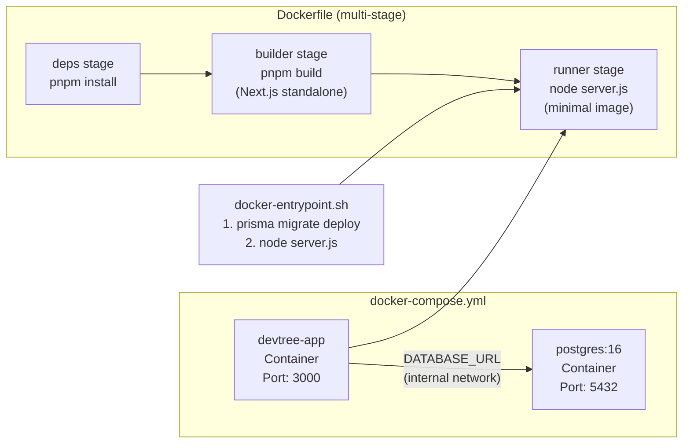
```mermaid
graph LR
    subgraph "docker-compose.yml"
        DB["postgres:16\nContainer\nPort: 5432"]
        AppContainer["devtree-app\nContainer\nPort: 3000"]
        AppContainer -->|"DATABASE_URL\n(internal network)"| DB
    end

    subgraph "Dockerfile (multi-stage)"
        Deps["deps stage\npnpm install"]
        Builder["builder stage\npnpm build\n(Next.js standalone)"]
        Runner["runner stage\nnode server.js\n(minimal image)"]
        Deps --> Builder --> Runner
    end

    AppContainer --> Runner
    Entrypoint["docker-entrypoint.sh\n1. prisma migrate deploy\n2. node server.js"] --> Runner
```

**Multi-stage Docker build:**

1. **deps** — installs all dependencies. Cached unless `package.json` changes.
2. **builder** — runs `next build` producing `.next/standalone` — a self-contained Node server with only production dependencies.
3. **runner** — copies only the standalone output (~50 MB) into a minimal Alpine image. Excludes `node_modules`, source files, tests, stories.

**Why `output: 'standalone'`?**

Next.js normally requires the full `node_modules` (~500 MB) at runtime. `standalone` mode traces which files are actually used and bundles only those, producing a production image that is 80-90% smaller.

---

## Further Reading

| Topic | Link |
|-------|------|
| Next.js App Router | https://nextjs.org/docs/app |
| React — thinking in React | https://react.dev/learn/thinking-in-react |
| ProseMirror (Tiptap's engine) | https://prosemirror.net/docs/guide/ |
| @dnd-kit concepts | https://docs.dndkit.com/introduction/concepts |
| Tailwind CSS | https://tailwindcss.com/docs |
| Excalidraw imperative API | https://docs.excalidraw.com/docs/@excalidraw/excalidraw/api/props/excalidraw-api |
| Excalidraw library format | https://docs.excalidraw.com/docs/codebase/frames#library |
| Prisma ORM | https://www.prisma.io/docs |
| Vitest | https://vitest.dev/guide/ |
| Playwright (.NET) | https://playwright.dev/dotnet/docs/intro |
